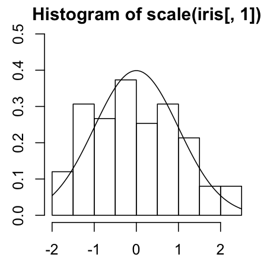

# はじめに

Rマークダウンでドキュメントとコード書いて→ knit() → pandoc → (html | pdf | docx) します。

## 役に立つ資料

- @teramonagiさんの資料
    - Tokyo.R@36 ～knitr+pandocではじめる～『R MarkdownでReproducible Research』 <http://www.slideshare.net/teramonagi/tokyo-r36-20140222>
    - Tokyo.R@36 ～knitrパッケージではじめる～『R MarkdownでReproducible Research』の基礎編のコード <http://rpubs.com/teramonagi/TokyoR36_Basic>
    - Tokyo.R@36 ～knitrパッケージではじめる～『R MarkdownでReproducible Research』の応用編のコード <http://rpubs.com/teramonagi/TokyoR36_Advanced>
- Pandoc ユーザーズガイド 日本語版 <http://sky-y.github.io/site-pandoc-jp/users-guide/>
- TeX Wiki <http://oku.edu.mie-u.ac.jp/~okumura/texwiki/>
- マークダウン用 github.css <https://gist.github.com/andyferra/2554919>

も参考にしてくださいね〜

# メタ情報の記述

マークダウンファイルにはメタ情報を含めることができます。

## 簡易記法

ファイル先頭を

```
% タイトル
% 著者
% 日付
```

で始めることができます。

## YAML記法

ファイルの先頭にYAMLでメタ情報を入れることができます。次の例を参考にして下さい。

```
---
title: RマークダウンとPandocで楽々レポート作成
author: "@ohske"
tags: [R, pandoc, Dynamic Documentation]
abstract: Rマークダウンでドキュメントとコード書いて→ knit() → pandoc → (html | pdf | docx)します。
---
```

# レポート生成コマンド (おなじない)

まずは、


```r
library(knitr)
knit("pandoc-md.Rmd")
```


としてRマークダウンファイル(.Rmd)からマークダウンファイルを作成します。
続いて、マークダウンファイルをPandocによって様々な形式に変換します。

- HTMLファイルの作成
```bash
$ pandoc -s --toc -c github.css --mathjax pandoc-md.md -o pandoc-md.html
```
    - github.cssというファイルを同じフォルダに入れときます。

- LaTeXファイルの作成
```bash
$ pandoc -s --toc --number-sections --listings -V documentclass=ltjarticle -H preamble.tex pandoc-md.md -o pandoc-md.tex
```
    - 必要の応じてプリアンブルを記述したpreamble.texを準備します。

- PDFファイルの作成
```bash
$ pandoc --toc --number-sections --listings -V documentclass=ltjarticle -H preamble.tex --latex-engine=lualatex -H preamble.tex pandoc-md.md -o pandoc-md.pdf
```
    - 必要の応じてプリアンブルを記述したpreamble.texを準備します。

- DOCXファイルの作成
```bash
$ pandoc pandoc-md.md -o pandoc-md.docx
```

- HTML5スライド(slidy)の作成
```bash
$ pandoc -s --mathjax -i -t slidy pandoc-md.md -o pandoc-slidy.html
```

- PDFスライド(Bearer)の作成
```bash
$ pandoc -t beamer --listings -H preamble-beamer.tex --latex-engine=lualatex pandoc-md.md -o pandoc-beamer.pdf
```
    - 必要の応じてプリアンブルを記述したpreamble-beamer.texを準備します。

## R上でpandocを使う

knitrパッケージには`pandoc()`という関数があるんですが、オプション渡すのが面倒なので`system()`でpandocを実行します。


```r
knit("pandoc-md.Rmd")
system("pandoc -s --toc -c github.css --mathjax pandoc-md.md -o pandoc-md.html")
system("pandoc -s --toc --number-sections --listings -V documentclass=ltjarticle -H preamble.tex pandoc-md.md -o pandoc-md.tex")
system("pandoc --toc --number-sections --listings -V documentclass=ltjarticle --latex-engine=lualatex -H preamble.tex pandoc-md.md -o pandoc-md.pdf")
system("pandoc pandoc-md.md -o pandoc-md.docx")
system("pandoc -s --mathjax -i -t slidy pandoc-md.md -o pandoc-slidy.html")
system("pandoc -t beamer --listings -H preamble-beamer.tex --latex-engine=lualatex pandoc-md.md -o pandoc-beamer.pdf")
```


# 例：あやめの解析 (またかよ・・・orz)

**あやめ**とは、~~さかな~~植物の名前です。おそらく、世界中でも最も多く解析にさらされた植物でしょう。

学名は*Iris sanguinea*といいます。イリスではなくて、アイリスです。
~大きい声では言えませんが今でも「イリス」と呼んでます。~

## データの雰囲気


```r
pander::pandoc(head(iris), caption="あやめのデータ (1-6行)", split.tables = 100)
```


-------------------------------------------------------------------
 Sepal.Length   Sepal.Width   Petal.Length   Petal.Width   Species 
-------------- ------------- -------------- ------------- ---------
     5.1            3.5           1.4            0.2       setosa  

     4.9             3            1.4            0.2       setosa  

     4.7            3.2           1.3            0.2       setosa  

     4.6            3.1           1.5            0.2       setosa  

      5             3.6           1.4            0.2       setosa  

     5.4            3.9           1.7            0.4       setosa  
-------------------------------------------------------------------

Table: あやめのデータ (1-6行)


## データの解析


```r
cor(iris[, -5])
```

```
##              Sepal.Length Sepal.Width Petal.Length Petal.Width
## Sepal.Length       1.0000     -0.1176       0.8718      0.8179
## Sepal.Width       -0.1176      1.0000      -0.4284     -0.3661
## Petal.Length       0.8718     -0.4284       1.0000      0.9629
## Petal.Width        0.8179     -0.3661       0.9629      1.0000
```


等幅フォントにできるかな

## データの可視化

ヒストグラムを作って、正規分布($\frac{1}{\sqrt{2\pi\sigma^2}} \exp\left(-\frac{\left(x-\mu\right)^2}{2\sigma^2}\right)$)と比べてみます。


```r
par(mar=c(2.5, 2.5, 1.5, 1))
hist(scale(iris[, 1]), probability = TRUE, ylim=c(0, 0.5))
curve(dnorm(x), add=TRUE)
```

 


# 最後に

Enjoy!!
