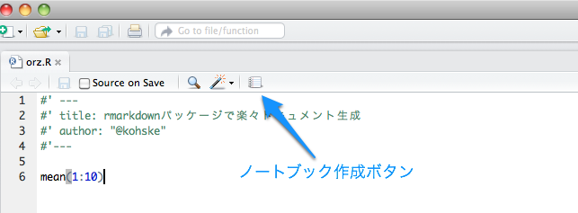
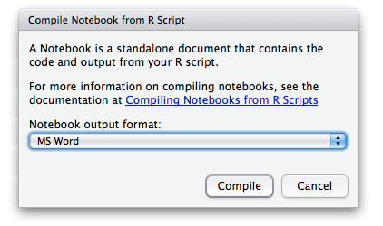
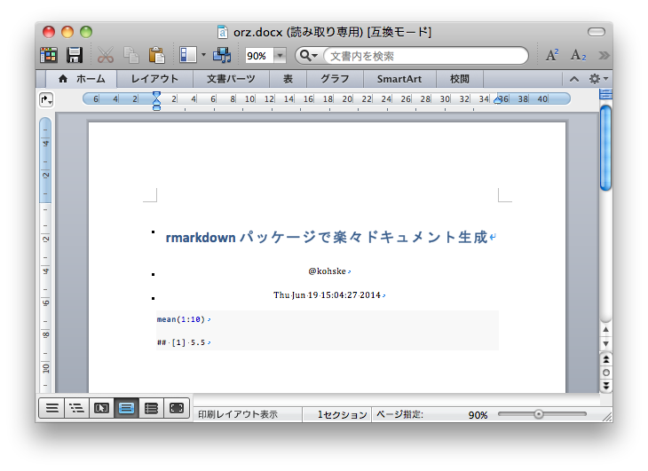
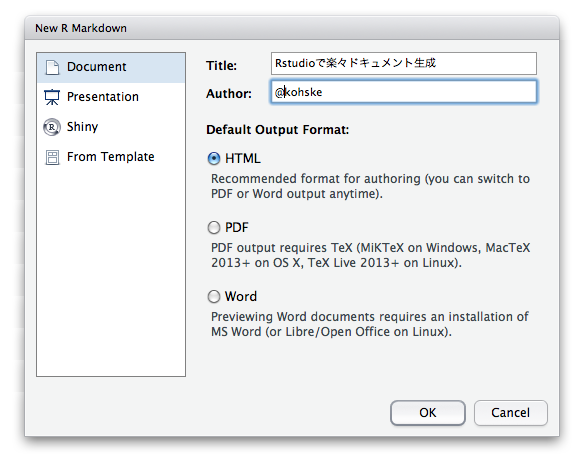
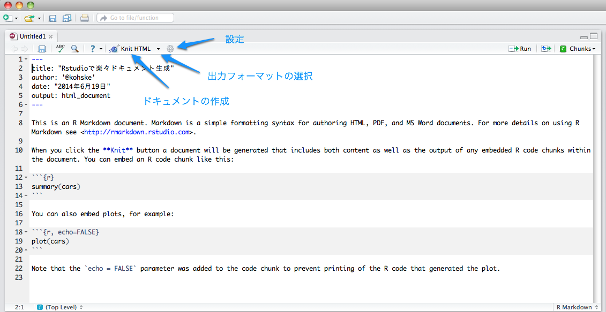
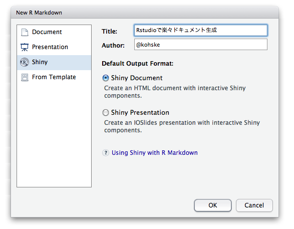
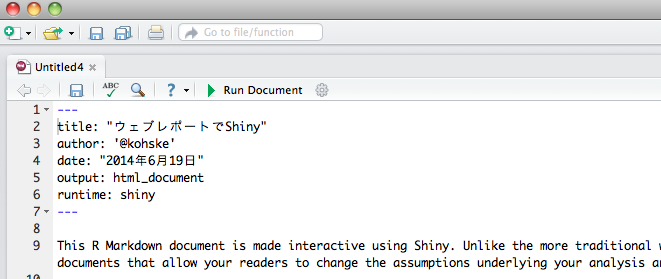
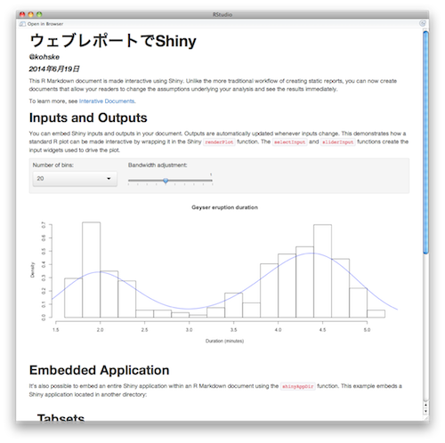

# はじめに

一言でいうと、Rstudio上でRマークダウンからHTML/PDF/MS Wordレポート、ウェブスライド、Shiny入りのレポートなどを作成できるようになりました。以下、解説です。

[シリーズ Useful R 9 「ドキュメント・プレゼンテーション生成」](http://kohske.github.io/R/useful_r_09/)
第8章ではRstudioのドキュメント生成支援機能について説明しています。
本書の内容は執筆時(2014年3月)の最新公式バージョン0.98.501をターゲットにしています。

2014年6月に最新公式バージョンが0.98.932となり、ドキュメント生成支援機能が大幅にアップデートされました。
ドキュメント変換に[`rmarkdown`パッケージ](http://rmarkdown.rstudio.com/)を採用しています。これに伴いユーザインタフェースにも若干の変更があります。`rmarkdown`パッケージやRマークダウンの書式の変更点については[解説記事 (rmarkdownパッケージで楽々ドキュメント生成)](http://kohske.github.io/R/rmarkdown/)をご覧ください。この解説記事ではRstudioについての変更点を説明します。

なお、`rmarkdown`パッケージも裏では`knitr`が仕事しているので、本書中の`knitr`の関する解説内容には大きな変更はありません。

# Rスクリプトからノートブックの作成

1. Rスクリプトを新規作成するか、既存のRスクリプトファイルを開きます。ここまでは同じです。
2. 編集画面の[Compile Notebook]というボタンをクリックします。ボタンの位置が変更されているので注意して下さい。新規ファイルの場合は保存ダイアログが開くので適当にファイル名をつけて保存して下さい。

3. ノートブックのフォーマットを選択するダイアログが開きます。現在、HTML、PDF、MS Wordの3種類が選択できます。

4. フォーマットに対応してプレビュー画面が開きます。次のキャプチャはMS Wordフォーマットでノートブックを作成したものです。



従来は、[Compile Notebook]をクリックするとタイトルや作成者を記入するダイアログが開きました(本書8.2節)。
新しいRstudioではタイトルや作成者はRスクリプトのYAMLフロントマターを使って次のように指定することができます。
YAMLフロントマターではこれ以外の項目も設定可能です。詳細は[解説記事 (rmarkdownパッケージで楽々ドキュメント生成)](http://kohske.github.io/R/rmarkdown/)をご覧ください。

```
#' ---
#' title: rmarkdownパッケージで楽々ドキュメント生成
#' author: "@kohske"
#'---
```

省略するとファイル名がタイトルに、ユーザ名が作成者になります。

# Rマークダウンからレポート作成

新しいRstudioではRマークダウンファイル(.Rmd)からHTML、PDF、MS Wordの各種レポート、ウェブスライドやBeamerスライド、Shinyドキュメントを作成できるようになっています。

1. [File]-[New File]または新規作成アイコン(本書図8.2)をクリックして[R Markdown...]を選択します。
2. ダイアログが表示されるので、タイトルと作成者を記入してレポートのフォーマットを選択します。なお、ここで記入、選択した情報は新規作成される.RmdファイルのYAMLフロントマターに反映されるだけなので、後で変更することも可能です。

    - [Document]はレポート形式の出力です。  
    - [Presentation]はウェブスライドやBeamerスライドです。  
    - [Shiny]はShinyウェブアプリを含むHTMLレポートやウェブスライドです。
3. ここではHTMLレポートを作成します。[OK]をクリックするとエディタの中に雛形が開きます。この中で、上の`---`で囲まれた部分はYAMLフロントマターです。ドキュメントのメタ情報を指定します。それ以降はテンプレなので適当に削除して大丈夫です。

4. [Knit HTML]をクリックするとレポートが作成されます。

    - .Rmdファイルを保存していない状態だと一時ファイルとしてレポートが作成されます。
    - .Rmdファイルを保存した後は、.Rmdファイルのあるフォルダにレポートが作成されます。

上のキャプチャにあるように、新しいRstudioではRマークダウンの編集パネルの中でレポート生成に関する設定を行うことができます。

- [Knit HTML]の右横の▼をクリックすると出力フォーマットを選択できます。
- その右横の歯車アイコンをクリックするとドキュメント作成のオプションを設定できます。

## Shinyのあるウェブレポートの作成

新しいRStudioではウェブレポートやウェブスライドの中にShinyウェブアプリを埋め込むことができます。

1. .Rmdを新規作成する際にShinyを選択します。Documentは通常のHTMLレポート、Presentationはウェブスライドです。  

2. テンプレが作成されるので、適当に編集します。  

3. 編集が終わったら、[Run Document]という再生アイコンをクリックします。ドキドキ。  
    - 未保存だとファイル保存ダイアログが出てきます。適当にファイル名付けて保存して下さい。
4. なんということでしょう！！プレビュー画面にはHTMLレポート、その中にShinyです。もちろんこれはインタラクティブに操作することができます。  


# R Presentation

R Presentation (本書8.4節)については、ユーザインタフェースに若干の変更はありますが、今のところ大きな変更はありません。

# 更新履歴

- 2014/6/19 作成しました。

# さいごに

Enjoy!!
